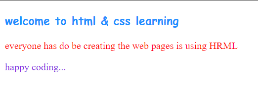
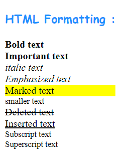

## HTML Documents

### What is HTML ?

1. HTML stands for `HyperText Markup Language`
2. It's standard markup language for creating web pages
3. It's describe the structure of web pages.
4. HTML elements tell the browser how to display the content
5. HTML elements label pieces of content such as `"this is heading", "this is paragraph" and "this is link", etc,..`

<hr>

### HTML Elements

1. The HTML elements is everything from the start tag to end tag

```
Example:
    
    <h3> welcome to html learning </h3>

```
- `<h3>` --> it's a starting tag   
- `</h3>` -->  it's a ending tag

2. some tags are single tags
    - like : `<br>` `<hr>` 

<hr>

### HTML Attribute

1. All HTML elements can have `attributes`.
2. Attributes provide `additional information` about elements.
3. Attributes are `always specified in the start tag`.
4. Attributes usually come in name/value pairs 
    - like :  `name="value"`
```
Example :

    <p style="color:red;"> welcome to html learning </p>
```

- output : 
    
    

    - The `style` attribute is used to add the styles to an element, 
    - such as `color, font, size, and more...`.

<hr>

### HTML commant tag

- you can add your commants in HTML file
```
<!-- Write your comments here -->
``` 
<hr>

### HTML using CSS : 

1. CSS can be added to HTML documents in 3 ways:
    - `Inline` - by using the `style` attribute inside HTML elements
    - `Internal` - by using a `<style>` element in the <head> section
    - `External` - by using a `<link>` element to link to an external CSS file

```
Example :

<!DOCTYPE html>
<html lang="en">
<head>
    <meta charset="UTF-8">
    <meta http-equiv="X-UA-Compatible" content="IE=edge">
    <meta name="viewport" content="width=device-width, initial-scale=1.0">
    <title>HTML & CSS</title>
    <link rel="stylesheet" href="./style.css">  <!-- this element is "External CSS" with linked to html file  -->
</head>
<!-- this element is "internal CSS" -->
<style>
    h3{
        font-family:cursive;
        color: dodgerblue;
    }
</style>
<body>
    <h3>welcome to html & css learning</h3>
    <p style="color:red">everyone has do be creating the web pages is using HRML</p>    <!-- this element is "inline CSS" -->
    <p>happy coding...</p>
</body>
</html>
```

- Output : 

    

<hr>

### HTML Formatting Elements
Formatting elements were designed to display special types of text:
```
        <b> Bold text </b>   
        <strong> Important text </strong>   
        <i> italic text </i>
        <em> Emphasized text </em>
        <mark> Marked text </mark> 
        <small> smaller text </small> 
        <del> Deleted text </del> 
        <ins> Inserted text </ins> 
        <sub> Subscript text </sub>
        <sup> Superscript text </sup>

```
- Sample :

    


<hr>

### HTML Block and Inline Elements

1. Block elements
    - A block-level element always starts on a new line, and the browsers automatically add some space (a margin) before and after the element.

    - A block-level element always takes up the full width available

    - Example : `<p> and <div>,.etc`

2. Inline elements

    - An inline element does not start on a new line.

    - An inline element only takes up as much width as necessary.

    - Example : `<span> and <b>,.etc`

<hr>

### HTML class Attribute
1. The HTML class attribute is used to specify a class for an HTML element.

2. Multiple HTML elements can share the same class.

    - Example : `<p class="first_paragraph">`